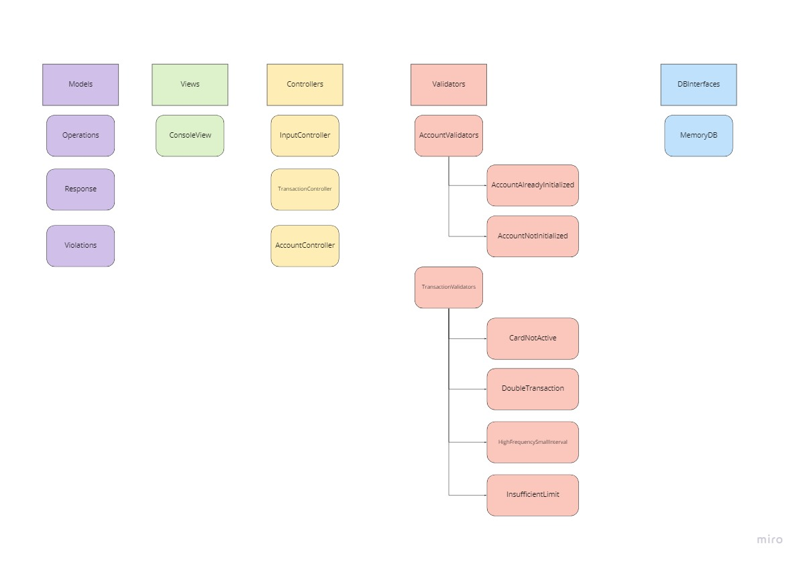
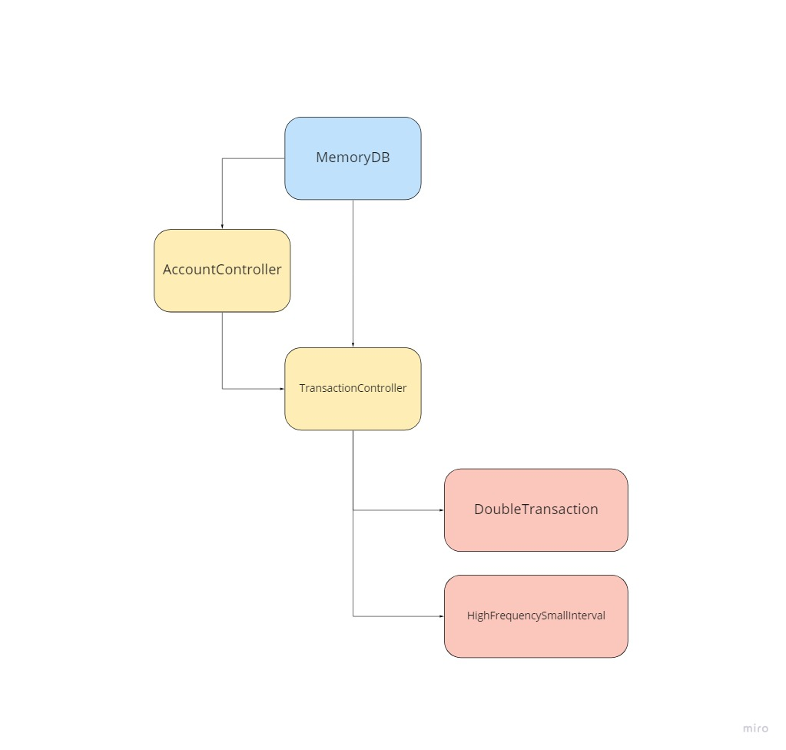
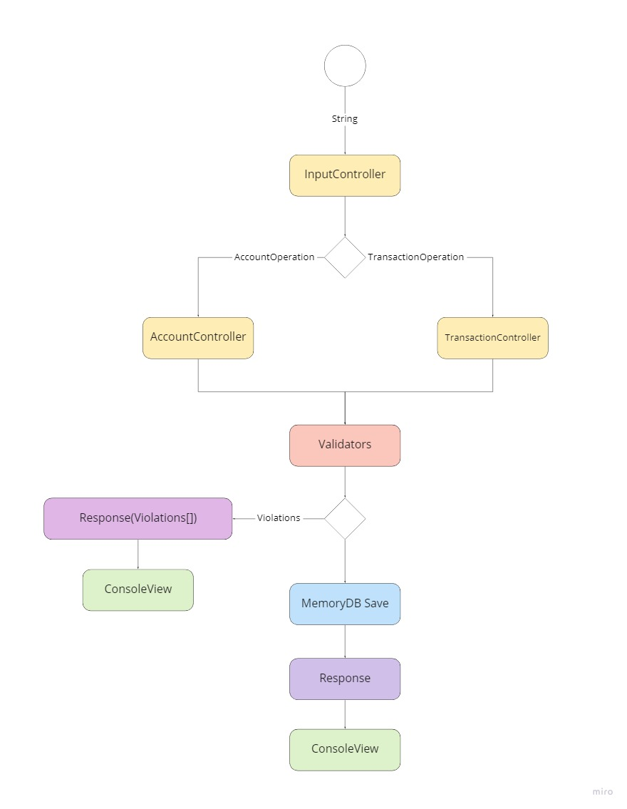

# Autorizador

# Decisões Técnicas e Arquiteturais

## MVC

Decidi organizar o projeto em uma arquitetura MVC pra facilitar a manutenção e entendimento da estrutura.

## Validators / Decorators

Para facilitar a inclusão de novas regras de validação, usei o design pattern **decorator** para adicionar regras de validação no projeto, dessa forma, para adicionar uma regra nova, será necessário criar uma extensão do **ValidationDecorator** e adicionar o uso no controller desejado.

## IDatabase

Caso seja necessário alterar a forma de salvar os dados da memória para um banco tradicional, o uso dessa interface vai facilitar na hora de fazer a manutenção.


# Frameworks

## Microsoft.NET.Test.Sdk

Utilizado para rodar os testes no .Net Core

## NUnit

Utilizado para criar os testes unitários.

## NUnit3TestAdapter

Utilizado para rodar os testes do NUnit no console

## Newtonsoft

Utilizado para fazer o parse do JSON para as classes no C# e também para fazer o parse da resposta de uma classe para string.

# Compilando e Executando

## Compilando
Para compilar o projeto para linux pode ser utilizado o comando:
```bash
dotnet publish -c release -o publish -r linux-x64
```
## Executando
Para executar diretamente pelo dotnet, pode utilizar na raiz do projeto o comando:
```
dotnet run --project NubankAuthorizer
```

Para facilitar existe um arquivo inputSample na raiz, assim pode-se testar o projeto com o comando:

```
dotnet run --project NubankAuthorizer < inputSample
```

## Testes
Para executar os testes, basta rodar o comando:
```
dotnet test
```


# Considerações

Para facilitar o entendimento da estrutura, criei alguns diagramas de projeto.

## Classes:


## Mapa de dependências
 


## Fluxograma


